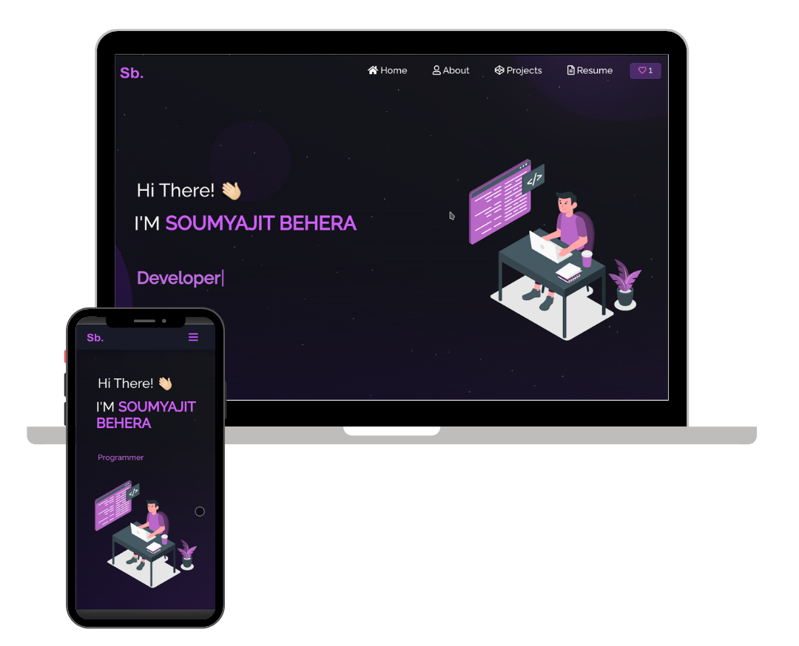

<h2 align="center">
  Portfolio Website 
  <a href="https://your-portfolio-link.vercel.app/" target="_blank">Your Portfolio Link</a>
</h2>

  

 

 &nbsp;
 &nbsp;
 &nbsp;
 &nbsp;

<h3 align="center">
    🔹
    <a href="https://github.com/prasadproject2025-alt/Portfolio/issues">Report Bug</a> &nbsp; &nbsp;
    🔹
    <a href="https://github.com/prasadproject2025-alt/Portfolio/issues">Request Feature</a>
</h3>

## TL;DR

This is the repository for my personal portfolio. The original template was created by [Soumyajit4419](https://github.com/soumyajit4419/Portfolio) - please give him proper credit if you decide to fork the base template!

## Built With

My personal portfolio which features some of my GitHub projects, resume, and technical skills.

This project was built using these technologies:

- React.js
- Node.js
- CSS3
- VS Code
- Vercel

## Features

**📖 Multi-Page Layout**

**🎨 Styled with React-Bootstrap and CSS with easy to customize colors**

**📱 Fully Responsive**

## Getting Started

Clone down this repository. You will need `node.js` and `git`[cite: 1, 2] installed globally on your machine.

## 🛠 Installation and Setup Instructions

1. Installation: `npm install`

2. In the project directory, you can run: `npm start`

Runs the app in the development mode.\
Open [http://localhost:3000](http://localhost:3000) to view it in the browser.
The page will reload if you make edits.

## Usage Instructions

Open the project folder and navigate to `/src/components/`.  
You will find all the components used and you can edit your information accordingly.

### Show your support

Give a ⭐ if you like this website!